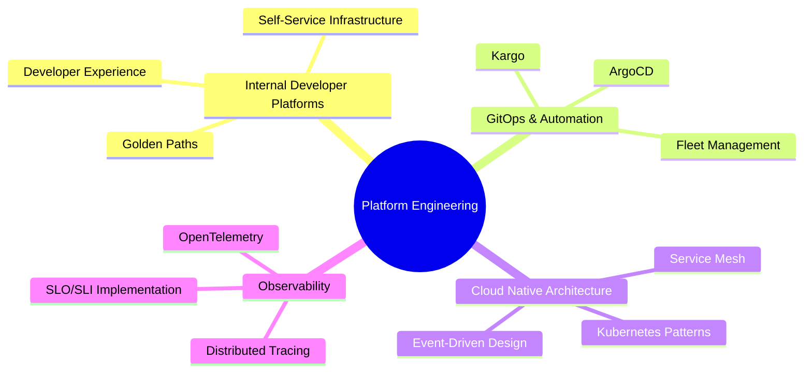

<div align="center">

# 👋 Hi, I'm Mahesh Sangawar

### 🚀 Cloud Architect | Platform Engineer | Full-Stack Developer

[](https://www.linkedin.com/in/mahesh-sangawar)
[](http://aws.amazon.com/verification)

</div>

---

## 🌟 About Me

> **Crafting innovative solutions where cloud architecture meets modern engineering**

I specialize in building **cloud-native platforms** that transform complex challenges into scalable systems, empowering teams to innovate and thrive faster. With expertise spanning multiple cloud providers and cutting-edge DevOps practices, I architect solutions that drive real business impact.

### 💼 What I Do

```yaml
Focus Areas:
  - 🏗️  Design and architect robust, scalable cloud systems
  - ☁️  Build and optimize developer platforms and tools  
  - 🔄  Implement cloud-native solutions with Infrastructure as Code
  - 🛠️  Develop full-stack applications with modern tech stacks
  - 👥  Lead and mentor high-performing development teams
  - 🚀  Modernize legacy systems using cutting-edge practices
  - 📊  Establish observability and monitoring best practices
```

---

## 🛠️ Tech Stack & Expertise

### 💻 **Languages**


### 🎨 **Frontend Development**


### 🎯 **State Management & UI**


### 🔧 **Backend & APIs**


### ☁️ **Cloud Platforms**


### 🚢 **Container Orchestration & GitOps**


### 🏗️ **Infrastructure as Code**


### 🗄️ **Databases & Storage**


### 🔍 **Monitoring & Observability**


### 🔄 **CI/CD & DevOps**


### 🧪 **Testing & Quality Assurance**


---

## 🏆 Key Achievements

<table>
<tr>
<td>

### 🚀 **Cloud Architecture**
- Architected cloud-native solutions processing **millions of transactions daily**
- Achieved **99.9% uptime** across distributed systems
- Reduced infrastructure costs by **40%** through optimization

</td>
<td>

### 🔄 **System Modernization**
- Transformed **5+ enterprise monoliths** into microservices
- Reduced deployment time by **70%** with IaC
- Improved system performance by **3x** through optimization

</td>
</tr>
<tr>
<td>

### 🛠️ **Developer Experience**
- Built platforms improving team productivity by **40%**
- Created reusable component libraries used by **50+ developers**
- Established GitOps practices with **95%+ deployment success**

</td>
<td>

### 📊 **Observability & Monitoring**
- Implemented end-to-end observability with **95% trace coverage**
- Reduced MTTR (Mean Time to Recovery) by **60%**
- Built custom dashboards and alerting systems

</td>
</tr>
</table>

---

## 🌟 Featured Projects

<div align="center">

| 🏗️ **Internal Developer Platform** | ☁️ **Cloud Migration Framework** | 🎨 **Enterprise Design System** |
|:---:|:---:|:---:|
| Built comprehensive IDP using **Go & Kubernetes** | Created reusable migration patterns | Developed design system with **React & Tailwind** |
| Improved developer productivity by **40%** | Reduced migration time by **60%** | Adopted by **10+ product teams** |
| **Tech:** Go, K8s, ArgoCD, Helm | **Tech:** Terraform, AWS, Azure | **Tech:** React, TypeScript, shadcn/ui |

</div>

---

## 🌱 Current Focus & Learning



### 🎯 **Areas of Interest**
- **Platform Engineering** - Building developer-centric platforms
- **GitOps & Continuous Delivery** - ArgoCD, Kargo, and progressive delivery
- **Cloud-Native Architecture** - Microservices, serverless, and event-driven systems
- **Developer Experience (DX)** - Tools and practices that accelerate development
- **Site Reliability Engineering** - Observability, monitoring, and incident response

---

## 📊 GitHub Stats

<div align="center">


</div>

---

## 🤝 Let's Connect & Collaborate

<div align="center">

**I'm always excited to discuss:**
- 🏗️ Platform Engineering & Internal Developer Platforms
- ☁️ Cloud Architecture & Multi-Cloud Strategies  
- 🔄 GitOps, DevOps, and Modern CI/CD Practices
- 🚀 Developer Experience & Team Productivity
- 📚 Mentoring & Knowledge Sharing

[](https://www.linkedin.com/in/mahesh-sangawar)
[](mailto:your.email@example.com)

---

*"Building platforms that empower developers to ship amazing products faster"* 🚀

</div>
