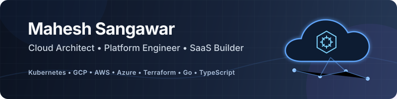

# Mahesh Sangawar

**Cloud architect and platform engineer. Sydney, Australia.**

I build platforms end to end: the cloud infrastructure underneath, the services and products above it, and the developer experience that connects them.

I am a Principal Consultant at Pixelight and a Founder of [**Tesserix**](https://tesserix.app), working across multi-tenant SaaS, Kubernetes platforms, cloud architecture and full-stack product engineering.

At Tesserix, I am building three products on a shared cloud platform: Mark8ly, HomeChef and Kora.

---

## Products

### [Mark8ly](https://mark8ly.com) &nbsp;·&nbsp; commerce

A multi-tenant commerce platform. A merchant signs up with an emailed link and gets a branded storefront and an admin dashboard on their own subdomain, with payments, shipping and tax handled per region. Go microservices and Next.js applications power the platform, with per-tenant isolation enforced in the data layer rather than left to convention.

### [HomeChef by FE3DR](https://fe3dr.com) &nbsp;·&nbsp; food delivery

A three-sided marketplace: home chefs cook, drivers deliver and customers order. A Go and Gin backend, a Next.js marketing site, React operations consoles for vendors and delivery, and Expo mobile apps support each side of the market.

### [Kora](https://github.com/tesserix/kora) &nbsp;·&nbsp; AI nutrition tracking

Nutrition tracking for iOS and Android that does not feel like data entry. Log a meal by photographing it, describing it out loud, or saying what you ate. The interesting problem is confidence: knowing when the model is sure enough to log silently and when it needs to ask.

---

## The foundation

### [Tesserix Design System](https://github.com/tesserix/design-system)

`@tesserix/web`, the component library every Tesserix product is built from. TypeScript, Tailwind and shadcn/ui principles, shipped for web and React Native so a product and its mobile counterpart remain recognisably part of the same family. Versioned with Changesets and published for reuse across every app.

Open source and published for anyone to use.

[Documentation](https://docs.tesserix.app) &nbsp;·&nbsp; [Storybook](https://ui.tesserix.app) &nbsp;·&nbsp; [Source](https://github.com/tesserix/design-system)

### The platform underneath

A single GKE Autopilot foundation runs every product above: Knative for scale to zero, Istio for the mesh, Argo CD and Kargo for GitOps promotion, OpenFGA for relationship-based authorisation, and Terraform for everything below that. Designed for cost-efficient operation, because a platform must be sustainable to remain useful.

---

## Open source

| Project | What it does |
|---|---|
| [**design-system**](https://github.com/tesserix/design-system) | `@tesserix/web`. Components for web and React Native, built on TypeScript, Tailwind and shadcn/ui. |
| [**cloudnav**](https://github.com/tesserix/cloudnav) | Fast, keyboard-driven multi-cloud TUI for Azure, GCP and AWS. Drill through resources without leaving the terminal. |
| [**reposhift**](https://github.com/tesserix/reposhift) | Azure DevOps to GitHub migration platform. Moves repositories, work items and pipelines. |
| [**sandboxctl**](https://github.com/tesserix/sandboxctl) | One-command local Kubernetes sandbox for macOS. kind, Argo CD, Kargo and Istio, ready to use. |
| [**agentic-registry**](https://github.com/tesserix/agentic-registry) | Gateway-neutral registry for agentic artefacts: skills, tools, MCP servers and prompts. |
| [**base-docker-images**](https://github.com/tesserix/base-docker-images) | Lean, non-root base images, rebuilt weekly against current CVEs. |
| [**homebrew-tap**](https://github.com/tesserix/homebrew-tap) | Homebrew formulae for Tesserix command-line tools. |

---

## Working with

**Languages** &nbsp; Go, TypeScript, Python, Java

**Platform** &nbsp; Kubernetes (GKE Autopilot), Knative, Istio, Argo CD, Kargo, Crossplane, Terraform, Helm

**Cloud** &nbsp; GCP, AWS, Azure

**Backend** &nbsp; Gin, gRPC, PostgreSQL with CloudNativePG, Redis, Pub/Sub, NATS, OpenFGA, OpenTelemetry

**Frontend** &nbsp; Next.js, React, React Native with Expo, Tailwind CSS

---

## Elsewhere

[tesserix.app](https://tesserix.app) &nbsp;·&nbsp; [Tesserix Blog](https://blog.tesserix.app) &nbsp;·&nbsp; [LinkedIn](https://www.linkedin.com/in/mahesh-sangawar-985a3214)
