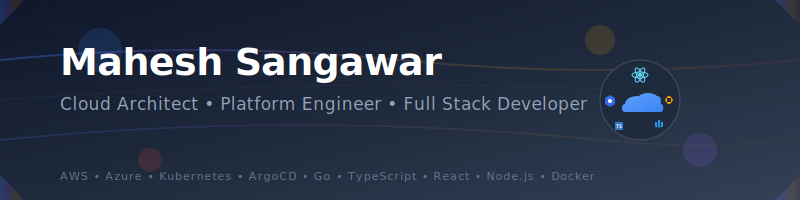

# 👋 Hi, I'm Mahesh Sangawar

## About Me 🚀
Crafting innovative solutions where cloud architecture meets modern engineering. I specialize in building cloud-native platforms that turn complex challenges into scalable systems, empowering teams to innovate and thrive faster.

### What I Do 💼
- 🏗️ Design and architect robust, scalable systems
- ☁️ Build and optimize developer platforms and tools
- 🔄 Implement cloud-native solutions and infrastructure as code
- 🛠️ Develop full-stack applications with modern technologies
- 👥 Lead and mentor development teams
- 🚀 Modernize legacy systems with cutting-edge practices

### Tech Stack 💻

#### Languages

#### Frontend Development

#### Styling & Design

#### Backend & API

#### Cloud & Infrastructure

#### Databases & Storage

#### DevOps & Containers

#### Monitoring & Observability

#### Testing & Quality

### 🌟 Key Achievements
- Architected and led development of cloud-native solutions processing millions of transactions daily
- Transformed multiple enterprise-level monolithic systems into modern microservices architectures
- Pioneered infrastructure as code implementations using Terraform, reducing deployment time by 70%
- Created scalable design systems and component libraries using modern React, Tailwind CSS, and shadcn/ui
- Established automated CI/CD pipelines with GitOps practices, achieving 99.9% deployment success rate
- Built developer platforms that improved team productivity by 40% using custom CLI tools and templates
- Implemented observability solutions using OpenTelemetry, achieving 95% trace coverage

### 🏆 Featured Projects

<table>
  <tr>
    <td align="center" width="33%">
      <strong>Developer Platform</strong> 
      Built an internal developer platform using Go, improving developer productivity and standardizing deployments
    </td>
    <td align="center" width="33%">
      <strong>Cloud Migration Framework</strong> 
      Created a reusable framework for migrating legacy applications to cloud-native architecture
    </td>
    <td align="center" width="33%">
      <strong>Design System</strong> 
      Developed a comprehensive design system using React, Tailwind, and shadcn/ui
    </td>
  </tr>
</table>

### 🌱 Current Focus
- Internal Developer Platforms (IDP)
- Platform Engineering best practices
- Cloud-native architectures
- Performance optimization
- Developer Experience (DX)

### 🤝 Let's Connect
Find me on [LinkedIn](https://www.linkedin.com/in/mahesh-sangawar) to discuss platform engineering, cloud architecture, or potential collaborations!
